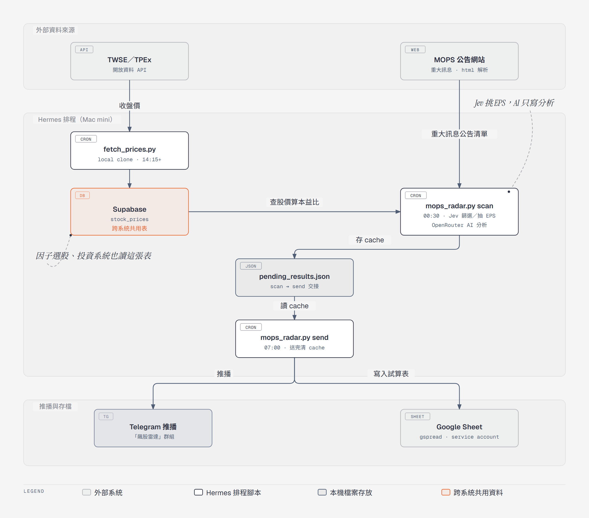

# mops-radar（~/mops_radar）

掃 MOPS 重大訊息公告，篩 EPS 條件，AI 分析後推 Telegram 與 Google Sheet。另外每日抓
TWSE/TPEX 收盤價寫回 Supabase `stock_prices`（`fetch_prices.py`，因子選股表也讀這張）。



（原始檔／可編輯版本：[docs/architecture.html](docs/architecture.html)）

## 測試

改 `mops_radar.py` 前後都跑一次（本機；Hermes 的 venv 沒裝 pytest，也不要裝進去——Hermes 自動更新會重建那顆 venv）：

```bash
pip install -r requirements-dev.txt
python -m pytest
```

- 全部離線：`tests/conftest.py` 會在 import 前把金鑰蓋成假值，並擋掉所有 `urlopen`，沒 mock 到的路徑會直接失敗（Hermes 上的 `.env` 是真金鑰，寧可測試失敗也不能真的送出 Telegram）。
- `tests/fixtures/mops_eps_announcements.json` 是 22 則人工逐則核對過的真實公告（2026-09 的 09/09、09/10、09/25、09/26、09/29），正確答案在 `tests/jev_live_check.py` 的 `TRUTH`。
- 改 `jev_questions()`、`number_candidates()`、`JEV_MIN_CONF` 這類會影響 Jev 抽取的東西，要真打 Jev 對答案：本機有金鑰用 `python -m pytest --live`；在 Hermes 上直接跑 `cd ~/mops_radar && /Users/iroman/.hermes/hermes-agent/venv/bin/python3 tests/jev_live_check.py`（不需要 pytest，只打 Jev，其他金鑰會先蓋成假值）。

## 陷阱

- **這個目錄（本機 git clone）是 `fetch_prices.py` 與 `mops_radar.py` 唯一的執行位置，GDrive 那份已退役。**
  早期兩支都跑在 Google Drive 那份
  `~/Library/CloudStorage/GoogleDrive-shih.sa@gmail.com/我的雲端硬碟/01_WORK/MOPS_RADAR/`，
  但 GDrive 掛載點反覆出事：cwd 落在該目錄讓 import 被 EINTR 中斷、FileProvider
  整個 degraded 時連 `open()` 都卡住不回應。2026-09-07 先把 `fetch_prices.py` 搬來這裡；
  2026-09-28 Hermes 背景自動更新後 gateway 改由 `osascript` 拉起，macOS 跳出
  「osascript 想要取用由 Google Drive 管理的檔案」權限框，沒人按之前 cron 行程卡在
  `open()`，scan/send 各逾時 4 次——同日把 `mops_radar.py` 也搬來這裡，
  `mops_radar_runner.py`（exec+timeout 包法）一併移除。
  **部署 = 這裡 commit+push（或 git pull），不用再同步 GDrive**；GDrive 那份只是舊檔，
  不要再改它，也不要再把任何排程指回去。`.env` 放這裡（不進 git）。
- **scan 與 send 是兩支獨立 cron，靠 `pending_results.json` 交接。** `mops_radar.py scan`（00:30）只分析存檔不送出；`mops_radar.py send`（07:00）才送 Telegram 並在送完刪 cache。CLI 沒帶參數預設是 `scan`——歷史上就發生過 send 腳本掉了參數，結果每天靜靜重跑 scan 從沒送出過。
- **cache 還在 = send 失敗，資料沒丟；重跑 send 只補沒做完的步驟。** 每筆 item 各自記 `gsheet_done`／`history_done`／`tg_sent`，每做完一步就回寫 cache。以前 send 先寫 Sheet 再送 Telegram，Telegram 一失敗重跑就把「公告紀錄」多插一列、公告次數多算一次（`sync_gsheet` 的 insert_row 沒去重）。Sheet 同步失敗時 send 會 exit 1 並只留那幾筆在 cache。**隔天 00:30 的 scan 也不會蓋掉沒做完的 item**，會標 `carried` 併進新 cache，Telegram 標題註明「含前次沒送出的 N 筆」、已送過的只補 Sheet。沒收到訊號時先看 `~/mops-radar-send-run.log`，再看 `pending_results.json` 是否留著；留著就直接重跑 send，不用重跑 scan。
- **scan 失敗一定會在 07:00 收到通知。** scan 拋例外時會先把錯誤寫進 cache（`error`／`failed_at`，前次沒做完的 item 照帶）再往上丟讓 cron 記失敗；send 看到 `error` 就送「⚠️ 掃描失敗」（錯誤訊息用 `html_escape`，`<urlopen error …>` 的角括號不跳脫 Telegram 會 400）。send 找不到 cache 時看 `.last_sent`：今天送過就安靜，否則送「找不到今天的掃描結果」。MOPS 連線失敗先重試 3 次；回應既沒公告也不是「查無…資料」（被擋、改版、錯誤頁）會拋錯，不會再被當成「今日沒有公告」。注意沒資料的實際字樣是「查無115/12/25之重大訊息資料」，不是舊程式判斷的「查無需求資料」。
- **`pending_results.json` 產生在這個目錄**（已 gitignore）。GDrive 那份目錄底下若又出現新的 cache，代表有腳本還指著舊路徑。
- **AI 評級一律先 `normalize_rating()` 再存 cache。** send 用完全相等比對 `🔴 強烈買進`／`🟠 建議買進` 決定寫不寫 Sheet，AI 少個空格就會悄悄不寫；scan 拿到 AI 結果後先比燈號、再比中文把它對回四個標準字串（對不到才當 🟡），改寫過的會在 log 印「評級字串不標準」。截至 2026-09-30 的 285 筆 log 還沒出現過不標準寫法，這是預防。
- **OpenRouter 只重試暫時性錯誤，連續 2 筆掛掉就熔斷。** `openrouter_chat()` 對逾時、連線錯誤、408/429/5xx/529、200 但沒 `choices` 最多試 3 次（等 5、15 秒，單次 timeout 60 秒）；400 這類請求本身有問題的不重試，錯誤訊息會帶 OpenRouter 回的內容（2026-08 那三次 400 只留下 Bad Request 查不到原因）。連續 2 筆重試用完仍失敗，其餘直接標「AI分析失敗」不再打，避免整個 scan 拖過 Hermes 執行上限被砍、連 cache 都沒寫。
- **AI 模型有備援，但 OpenRouter 的 `models` 陣列救不了「模型下架」。** `AI_MODELS`（預設 `gemini-3.1-flash-lite-preview` → `gemini-2.5-flash-lite` → `gemini-2.5-flash`，可用同名環境變數覆寫，逗號分隔）整串放進 `models` 送出，下游掛掉、限流由 OpenRouter 自己往下跳。**但 2026-09-30 實測：陣列裡只要有一個 ID 無效，OpenRouter 整個 request 直接 400「is not a valid model ID」，不會跳。** 所以 `openrouter_chat()` 看到 400/404 且是模型失效字樣（not a valid model ID／No endpoints found），就把那個模型記進 `_dead_models`、用剩下的立刻重打（不算重試次數），這次執行後面的公告也直接略過它。用到備援的 item 會記 `model_used`，Telegram 標題加註「其中 N 筆由備援模型 … 分析」——**看到這行連續出現，就是主模型下架了，去改 `AI_MODELS`**。全部失效才拋錯。
- **Telegram 訊息裡所有字都要先跳脫，只放回成對的 `<b></b>`。** `parse_mode: HTML` 只要一個裸的 `&`／`<`（「營收&獲利」「EPS<0」）或沒閉合的 `<b>`，整則直接 400 拒收。`_render_block()` 對公司名稱等欄位 `html_escape`；AI 的 `display_text` 走 `ai_html_to_telegram()`：`<br>` 轉換行、其他標籤拿掉、先 unescape 再 escape（AI 自己寫的 `&amp;` 不會變兩次），再只放回 `<b>`／`</b>`，巢狀或沒配對就整段拿掉粗體。`send_telegram()` 還有最後一道：Telegram 回 400 且內容含 parse（例如長訊息逐字切段切斷了 `<b>`）就改送純文字；其他錯誤照樣拋出給 send 的逐則重送。**新增任何會進 Telegram 的欄位都要經過跳脫。**
- **休市日由 `fetch_prices.py` 自己擋。** 開跑先查證交所休市日曆（`market_holiday_name()`），休市就印「休市，不抓價」、exit 0，`fetch-prices-persistent-retry.sh` 看到這幾個字會寫當天標記檔、不再重跑。cron 仍是週一到五固定觸發，不用改排程。日曆查不到時照常抓價；**颱風假不在日曆上，擋不到**，那天照樣會有 23:40 告警。
- **清單頁的說明就是全文，不要再加回詳細頁。** `ajax_t05st02` 每個 form 的隱藏欄位 `h?8` 跟「詳細資料」頁一字不差（2026-09-29 全天 243 則逐一比對）。舊版另外用 `t05sr01_1` 拿 SEQ_NO 抓詳細頁，但那頁不吃日期參數，scan 改到 00:30 後每天 0 筆、白印兩百多行「無詳細頁參數」，已整段移除。懷疑漏抓 EPS 時先查 `h?8` 有沒有被截斷。
- **Jev 只負責「刪」，而且失敗一律放行。** scan 的關鍵字篩完後，對每筆問 TypeSafe Jev「是不是在公布自家獲利」，機率 < `JEV_THRESHOLD`（預設 0.2）才剔除，log 會印 `✂ 機率 代號 主旨`。沒 `TYPESAFE_API_KEY`、401、逾時都照樣放行，不能因為 Jev 掛掉漏訊號。門檻 0.2 是 2026-09-29 用 10 個交易日實測定的：面額變更／更正歷年財報 ≤ 0.06、真正的財務業務公告 ≥ 0.42。沒收到某檔訊號時，先 grep log 裡的 `✂` 看是不是被 Jev 剔掉。
- **EPS／營收由 Jev 從公告數字裡「挑」，不是 regex 抓第一個數字。** 舊的 `regex_financials()`（找第一個「每股盈餘」往後取數字）只有「注意交易資訊」固定表格抓得對，自結損益的自由文字會出事：遠東銀主旨含「每股盈餘」抓到淨利 462717、華南金／彰銀／豐泰把 1~8 月累計 EPS 當單月 ×12、營收單位仟元被當百萬——本益比一錯，AI 照「系統預算值」評級就會亂給 🔴。現在 `jev_judge()` 跟獲利判斷同一個 request 問 6 題 Choice：程式先把公告每個數字列成候選（附所在行＋依顯示寬度對齊找到的同欄表頭），Jev 只能原樣挑一個或選「無」。三道把關：信心 < `JEV_MIN_CONF`（0.8）當沒資料；單月／單季 EPS 挑到的欄位表頭含「累計／四季」由程式硬擋（高雄銀「本月份」欄空白那種表，Jev 會高信心挑累計欄；另問一題「有沒有單月EPS」實測反而誤殺浩宇、漢達，已放棄）；Jev 失敗才退回 regex。2026-09-30 用 5 天 31 則人工核對：Jev 0 錯、regex 15 錯。log 的 `抽取（jev|regex）` 那行會印挑到的數字與各題信心，懷疑 EPS 錯先看這行。
- **股價與成交量一律查 Supabase `stock_prices`**，不要讓 AI 從公告內文自己編，也不要重新引入本機 json 快取。
- **python 一律寫死 hermes-agent venv：`/Users/iroman/.hermes/hermes-agent/venv/bin/python3`**（系統 `/usr/bin/python3` 缺 gspread/supabase）。**不要**再加 `export PYTHONPATH="$HOME/Library/Python/3.9/lib/python/site-packages..."` 借舊套件：Hermes 背景自動更新會重建這顆 venv（2026-09-06 從 3.9 換成 3.11），借來的 cp39 `pydantic_core` 會讓 Supabase 讀取悄悄失敗、股價全變 0。
